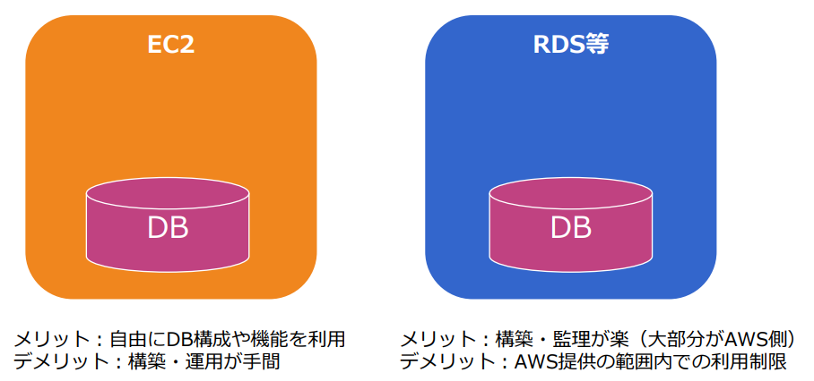
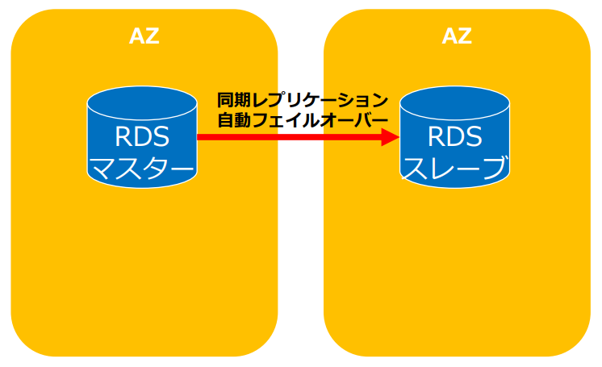
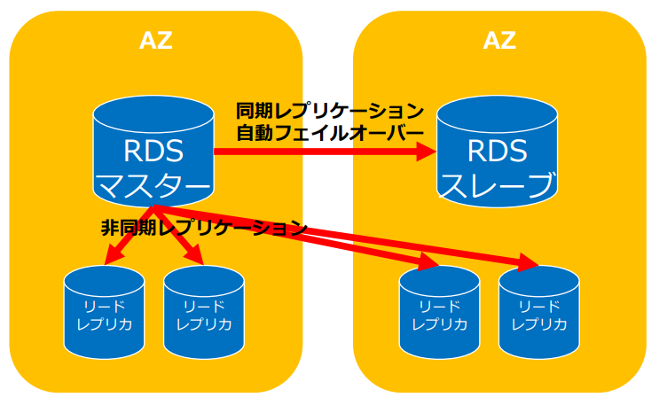
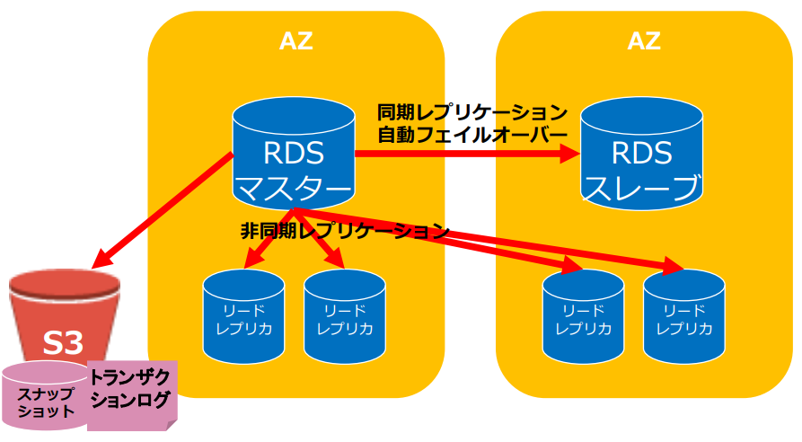
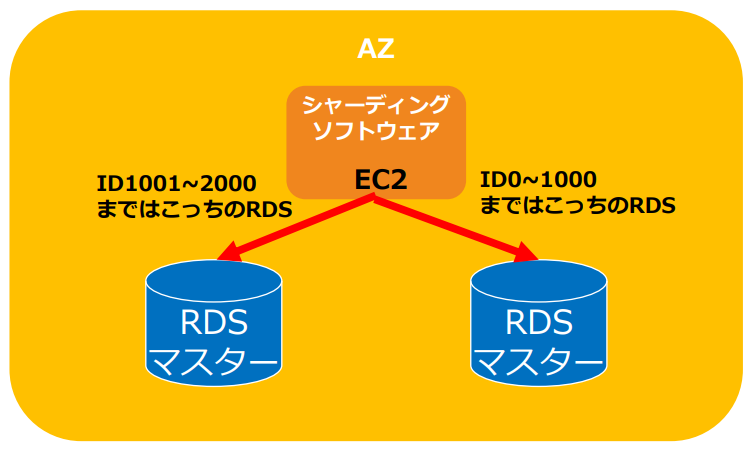

# RDSの概要
# 1. RDSとは
RDSは様々なデータベースソフトウェアに対応したフルマネージドなリレーショナルデータベースのサービスです。  
以下のような標準ソフトウェアを利用したデータベースを構築できます。
- MySQL
- Oracle
- MicrosoftSQLServer
- PostgreSQL
- MariaDB
- AmazonAurora
# 2. AWSのデータベース構築

AWSにおけるデータベース構築はEC2に自らインストールして構築するか、専用DBサービスを利用するかの２通りがあります。  
それぞれのメリット・デメリットは以下のとおりです。

| メリット・デメリット | EC2 | RDS等 |
|-------|-------|-------|
| メリット | 自由にDB構成や機能を利用できる | 構築・管理が楽（大部分がAWS側） |
| デメリット | 構築・運用が手間 | AWS提供の範囲内での利用制限 |
# 3. RDSの制約事項
RDSはマネージド型で管理などが楽な反面、AWSから提供される機能範囲内での制限を受けます。  
RDSの主な制限事項としては以下があります。
- バージョンが限定される
- キャパシティに上限がある
- OSへのログインができない
- ファイルシステムへのアクセスができない
- IPアドレスが固定できない
- 一部の機能が使えない
- 個別パッチは適用できない
# 4. RDSの特徴

RDS自体がマネージド型で高可用なことに加えて、マルチAZによりMaster/Slave構成を用意に構築することができます。  
マルチAZにすることで１つのAZ、つまり１つのデータセンターが地震などの災害で停止してしまってももう１方のAZのデータベースに切り替えることでシステムの稼働を維持することができます。  
このようにMasterとSlaveを作ってMasterのDBが停止しても自動的にSlaveのDBに切り替えることができる構成をMaster/Slave構成と呼び、MasterからSlaveに切り替わることをフェイルオーバーと呼んでいます。  

この場合、SlaveのDBはもしもの時に待機しておく必要があり、MasterのDBの最新状況がSlave側にも反映されている必要があります。  
このMasterに対する更新をSlaveにコピーされる機能をレプリケーションと呼んでおり、Masterが更新された直後にSlaveのデータも更新されることを同期レプリケーションと言います。

リードレプリカと呼ばれる参照専用のレプリカを最大５台（Auroraの場合は１５台）設置して、DBの読み取り処理をスケールアウトすることができます。  
データの取得のリクエストが大量に発生するという場合に活用することで効率的にサーバーのリソースを活用することができます。  
リードレプリカはMaster/Slave構成とは違い、非同期レプリケーションになっており、若干のタイムラグがあってから同期する動きになっています。  
またこのリードレプリカもMaster/Slave同様に別のAZに配置して負荷分散を行うことも可能です。

自動/手動でスナップショットを取得して保存管理して、耐障害性を確保することができます。  
スナップショットはAWS内部ではS3に保存される形になっています。  
DBを誤って削除したり、データを誤って更新してしまった場合に、このスナップショットからDBを復元することができます。  
またトランザクションの内容を出力したトランザクションログというログをRDSで保持しており、スナップショットから復元して更にトランザクションログを利用してデータを復元することで直前のDBの状態にまで復旧させることができます。
# 5. スケーリング
RDSはマネジメントコンソールやAPIからスケールアップすることが可能です。  
以下のような特徴があります。
- インスタンスタイプを変更してスケールアップ／ダウンを実施
- コマンドライン (AWS CLI) やAPIからストレージを数クリックで容易にスケールアップ／ダウンをする
- 一時的にインスタンスタイプを大きくして、その後戻すことも可能
- ストレージサイズは、拡張はできるが縮小はできない

データベースシャーディングを利用してRDSの書き込み処理をスケーリングすることもできます。
# 6. DBインスタンスの暗号化
RDSは保管時のインスタンスとスナップショットの暗号化が可能です。  
## 6-1. 暗号化対象
- DBインスタンス
- 自動バックアップ
- リードレプリカ
- スナップショット
## 6-2. 暗号化方式
- AES-256暗号化
- AWS KMSによる鍵管理
- リードレプリカも同じ鍵を利用
- インスタンス作成時にのみ設定可能
- スナップショットのコピーの暗号化／リストア可能