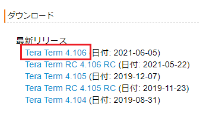
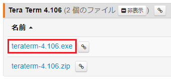
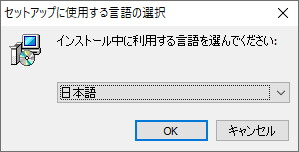
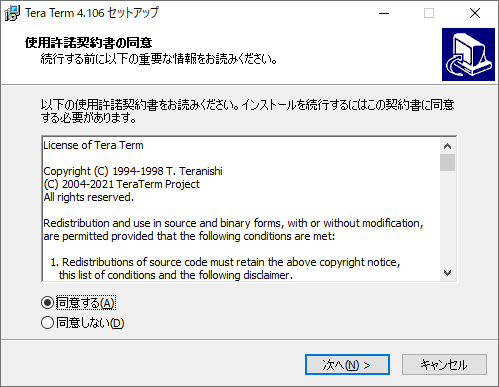
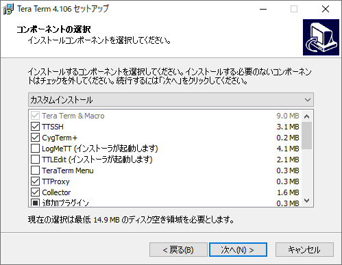
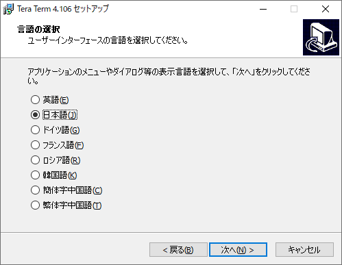
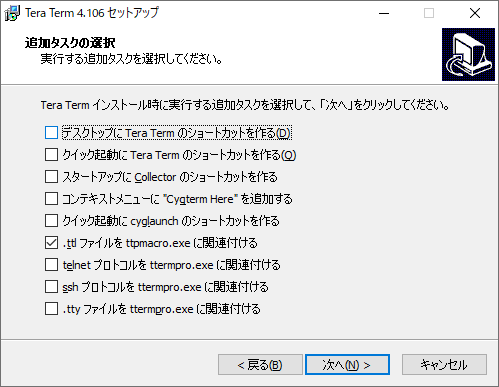
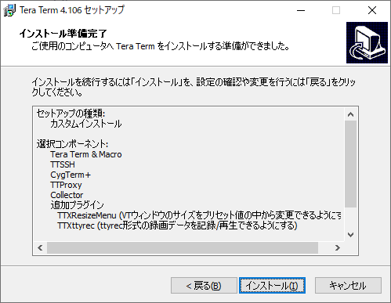

# 必要なソフトウェアの準備
本カリキュラムでは「TeraTerm」というSSHクライアントを利用してサーバーに接続します。  
## 1.インストーラのダウンロード
こちらの[リンク](https://ja.osdn.net/projects/ttssh2/)からインストーラをダウンロードしてPCにインストールしてください。
※最新のバージョンの無印（RCなど付いていない）でexe形式のものをダウンロードしてください

## 2.インストール
### 2-1.言語の選択
「日本語」が選択されていることを確認して「OK」をクリックする

### 2-2.使用許諾契約書の同意
「同意する」を選択して「次へ」をクリックする

### 2-3.コンポーネントの選択
デフォルトのまま「次へ」をクリックする

### 2-4.言語の選択
「日本語」が選択されていることを確認して「次へ」をクリックする

### 2-5.追加タスクの選択
デフォルトのまま「次へ」をクリックする

### 2-6.インストール準備完了
設定内容を確認して「インストール」をクリックする
